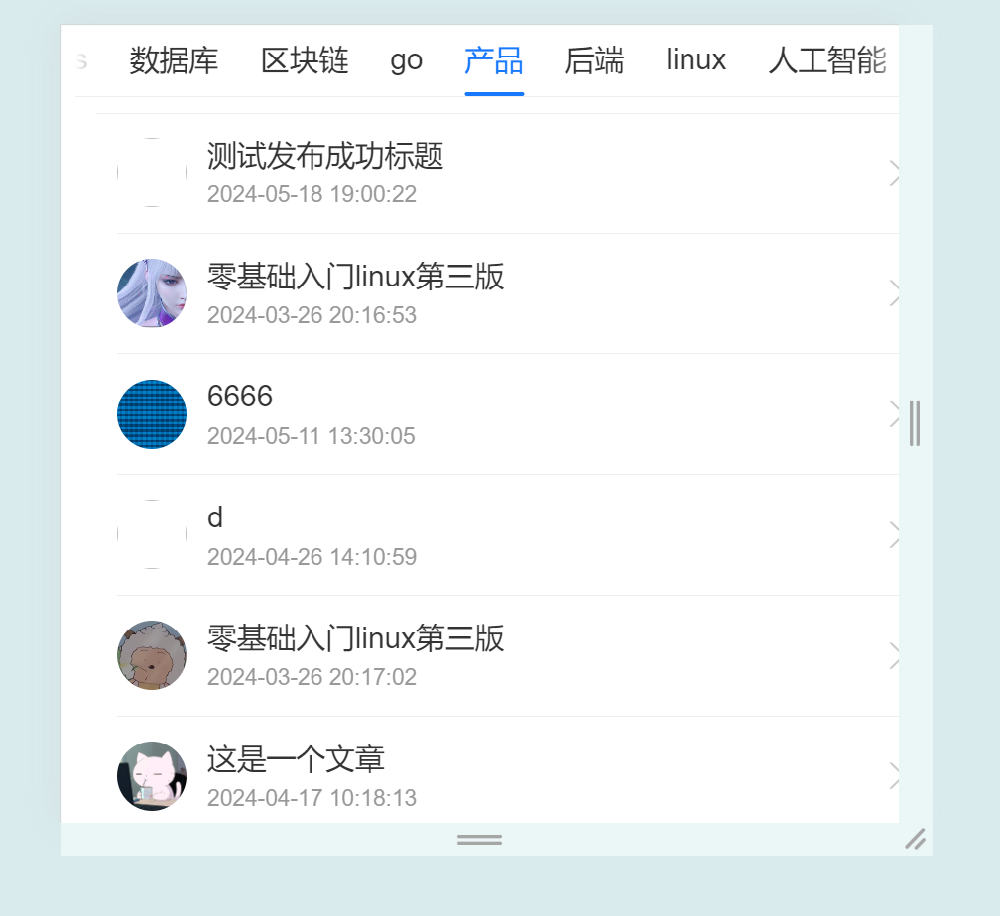

# Getting Started with HeadlineHub-Mobile
**HeadlineHub-Mobile** is a mobile application that provides an easy way to view headlines across different categories.

In the project directory, you can run:

### `npm run dev`

## Home Page

